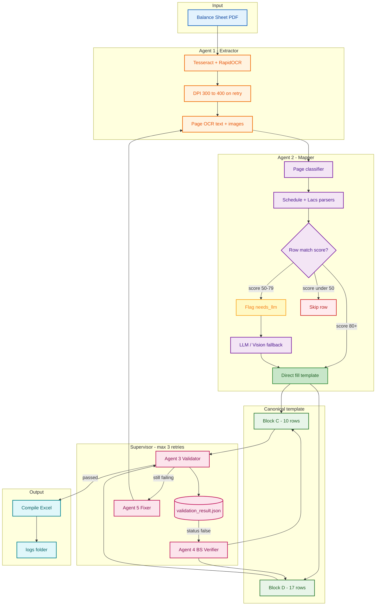
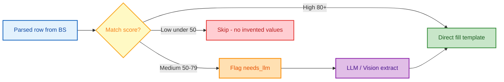

# Compile Sheet Extraction (Enterprise)

Extract **Block C (Fixed Assets)** and **Block D (Working Capital)** from **balance sheet PDF only** into a fixed Excel template. No compile schedule is required in production.

---

## Graphical architecture

### End-to-end flow



### Row routing (mapper confidence)



### `validation_result.json` (balance sheet only — no compile golden)

| Field | Meaning |
|--------|---------|
| `status: true` | Filled value matches re-parse from **same balance sheet** OCR |
| `status: false` | Mismatch or missing — BS Verifier agent targets this field |
| `expected_from_bs` | Value found again on BS summary / notes pages |
| `got` | Value currently in Block C / D |
| `hint_pages` | Which PDF pages to re-read |
| `fixed: true` | Verifier patched the template after re-check |

Golden JSON (`config/golden/`) is **optional QA only** — not used in this loop.

---

## Requirements

- Python 3.10+
- Tesseract OCR (`C:\Program Files\Tesseract-OCR\tesseract.exe`)
- Ollama on `http://localhost:11435`
- Models: `gemma4:31b` (vision + text)

```powershell
ollama pull gemma4:31b
pip install -r requirements.txt
```

---

## Quick start (production — balance sheet only)

```powershell
cd C:\Users\T6\Desktop\extract\data_extraction
.\venv\Scripts\Activate.ps1

$env:OLLAMA_BASE_URL = "http://localhost:11435"
$env:OLLAMA_VISION_MODEL = "gemma4:31b"
$env:OLLAMA_TEXT_MODEL = "gemma4:31b"

# BS verifier loop ON by default (recommended)
$env:VERIFY_LOOP = "1"

python main.py "data\Your_Balance_Sheet.pdf" -o "outputs\Your_Output.xlsx" --save-ocr
```

Or:

```powershell
.\run.ps1 "data\Your_Balance_Sheet.pdf" "outputs\Your_Output.xlsx"
```

---

## Environment variables

| Variable | Default | Purpose |
|----------|---------|---------|
| `OLLAMA_BASE_URL` | `http://localhost:11435` | LLM / vision API |
| `OLLAMA_VISION_MODEL` | `gemma4:31b` | Block C vision fallback |
| `OLLAMA_TEXT_MODEL` | `gemma4:31b` | Text mapper fallback |
| `VERIFY_LOOP` | `1` | Enable BS Verifier agent + `validation_result.json` |
| `SKIP_BLOCK_D_LLM` | `0` | Set `1` to skip slow Block D LLM fallback |
| `MAX_ATTEMPTS` | `3` | Supervisor retry count |

---

## Project layout

```
data_extraction/
  compile_extraction/
    audit.py           # Structured logs
    bs_verifier.py     # Agent: BS cross-check + JSON-driven fix
    config.py
    schema.py          # Block C (10) / Block D (17) templates
    excel.py
    quality.py         # Internal formula rules
    pipeline.py
  main.py              # CLI
  schedule_parser.py   # Deterministic BS parsers
  run_agentic_pipeline.py
  logs/{pdf_stem}/
    extraction.log
    ocr.log
    verification.log
    mapping.log
    validation_result.json   # ← BS cross-check (true/false per field)
    audit_report.json
    ocr_pages/
  config/golden/       # Optional QA only
  data/
  outputs/
```

---

## Agents summary

| Agent | Role | Source of truth |
|-------|------|-----------------|
| **1 Extractor** | OCR all PDF pages | Balance sheet PDF |
| **2 Mapper** | Fill Block C & D from schedules / notes | Balance sheet PDF |
| **3 Validator** | Row formulas (4=1+2+3, etc.) | Compile **template rules** |
| **4 BS Verifier** | Read `validation_result.json`, fix `status: false` | **Same balance sheet** re-OCR |
| **5 Fixer** | Re-run mapper for remaining errors | Balance sheet PDF |
| **Reporter** | Confidence + Excel write | — |

---

## Logs and audit

After each run:

```text
logs/Balance_Sheet_of_Your_Company/
  validation_result.json   # field-level status true/false vs BS re-parse
  audit_report.json
  extraction.log
  ocr.log
  verification.log
```

Example `validation_result.json` entry:

```json
{
  "block": "D",
  "sl_no": 9,
  "field": "closing_rs",
  "status": false,
  "reason": "bs_reparse_mismatch",
  "got": 378401000,
  "expected_from_bs": 378401000,
  "match_score": 95,
  "hint_pages": [1, 6],
  "fixed": true
}
```

---

## Optional golden (dev / QA only)

```powershell
python verify.py outputs\Your_Output.xlsx --golden config\golden\dsl_118184.json
```

Not used when `VERIFY_LOOP=1` production path runs.

---

## Notes

- Extraction is **generic** — no company numbers hard-coded in the pipeline.
- **100% accuracy** is not guaranteed (OCR limits, BS line ≠ compile row definitions); BS Verifier maximises correctness from the **same PDF**.
- Row 7 Block D = rows 4+5+6 (no goods-in-transit). Derived rows computed in Python.
- Two format families: **schedule annex** (e.g. 118184) and **amounts in lacs** (e.g. 114045).
