# Enterprise Balance Sheet Extraction Pipeline

> **100% Local | Zero Cloud | Open Source | Multi-Agent Agentic Flow**

Scanned / digital government financial PDFs se **Block C (Fixed Assets)** aur **Block D (Working Capital)** ka data accurately extract karke Excel Compile Sheet mein fill karta hai.

---

## Problem Solved

| Old Approach | New Approach |
|---|---|
| Vision LLM ko poori image dedo | pdfplumber se exact cell matrix nikalo |
| Column shift — galat numbers galat column mein | Har cell ka exact (row, col) position known |
| Koi verification nahi | 3-agent loop — extract → verify → audit |
| Scale bug — 3 jagah alag multiplier | ek config.py mein `PDF_UNIT_MULTIPLIER` |
| Schema 3 files mein duplicate | ek `schemas.py` — baaki sab import karte hain |

---

## Full Architecture

```
┌─────────────────────────────────────────────────────────────────────────────────┐
│                        ENTERPRISE EXTRACTION PIPELINE                           │
│                                                                                 │
│   INPUT                                                                         │
│   ─────                                                                         │
│   Balance Sheet PDF (Scanned / Digital)                                         │
│         │                                                                       │
│         ▼                                                                       │
│ ┌───────────────────────────────────────────────────────────────────────────┐   │
│ │  LAYER 1 — PDF PROCESSOR  (pipeline/pdf_processor.py)                    │   │
│ │                                                                           │   │
│ │   Text PDF?  ──→  pdfplumber (exact cell bounding boxes)                 │   │
│ │                        │                                                  │   │
│ │   Scanned PDF? ──→  [USE_SURYA=1] Surya Table Recognition (AI)           │   │
│ │                     └──→  Surya OCR (per-cell, 90+ languages)            │   │
│ │                OR  [default]  OpenCV (grid line detection)                │   │
│ │                     └──→  Tesseract OCR (per-cell)                       │   │
│ │                                                                           │   │
│ │   Output: CellMatrix [ [row0col0, row0col1, ...], [row1col0, ...] ]      │   │
│ └───────────────────────────────────────────────────────────────────────────┘   │
│         │                                                                       │
│         ▼                                                                       │
│ ┌───────────────────────────────────────────────────────────────────────────┐   │
│ │  LAYER 2 — TABLE DETECTOR  (pipeline/table_detector.py)                  │   │
│ │                                                                           │   │
│ │   ├─ RapidFuzz → classify table as "block_c" or "block_d"                │   │
│ │   ├─ Header row detect → map column index to field name                   │   │
│ │   │    e.g. col[3] → "gross_opening", col[7] → "dep_up_to_end"           │   │
│ │   └─ Positional fallback if no header found                               │   │
│ │                                                                           │   │
│ │   Output: TableData { block_type, col_map, data_rows }                   │   │
│ └───────────────────────────────────────────────────────────────────────────┘   │
│         │                                                                       │
│         ▼                                                                       │
│ ┌───────────────────────────────────────────────────────────────────────────┐   │
│ │  LAYER 3 — ROW MAPPER  (pipeline/row_mapper.py)                          │   │
│ │                                                                           │   │
│ │   RapidFuzz fuzzy match:                                                  │   │
│ │   "P & M"  ──(score=92)──→  "Plant and Machinery"    → GREEN             │   │
│ │   "Fuels"  ──(score=88)──→  "Fuels & Lubricants"     → GREEN             │   │
│ │   "Misc."  ──(score=61)──→  "Others"    → YELLOW (_needs_llm=True)       │   │
│ │   "???"    ──(score=30)──→  UNMATCHED (skipped)                          │   │
│ │                                                                           │   │
│ │   Threshold:  ≥80 = HIGH confidence  |  50-79 = needs LLM  |  <50 = skip│   │
│ │                                                                           │   │
│ │   Output: mapped rows merged into canonical 10-row / 17-row template     │   │
│ └───────────────────────────────────────────────────────────────────────────┘   │
│         │                                                                       │
│         ▼                                                                       │
│ ╔═══════════════════════════════════════════════════════════════════════════╗   │
│ ║  SUPERVISOR LOOP  (supervisor/orchestrator.py)                           ║   │
│ ║  MAX 3 RETRIES — DPI escalates: 300 → 350 → 400                         ║   │
│ ║                                                                           ║   │
│ ║   ┌─────────────────────────────────────────────────────────────────┐    ║   │
│ ║   │  AGENT 1 — EXTRACTOR  (agents/agent_1_extractor.py)            │    ║   │
│ ║   │  Model: gemma3:4b (Ollama local)                                │    ║   │
│ ║   │                                                                  │    ║   │
│ ║   │  Sirf _needs_llm=True rows ke liye LLM call:                    │    ║   │
│ ║   │  ├─ Ambiguous label → canonical name resolve                    │    ║   │
│ ║   │  └─ Noisy OCR cell → clean number parse                         │    ║   │
│ ║   │                                                                  │    ║   │
│ ║   │  If Ollama unavailable → rows as-is (deterministic mode)        │    ║   │
│ ║   └──────────────────────────────┬──────────────────────────────────┘    ║   │
│ ║                                  │ extracted rows                        ║   │
│ ║                                  ▼                                       ║   │
│ ║   ┌─────────────────────────────────────────────────────────────────┐    ║   │
│ ║   │  AGENT 2 — VERIFIER  (agents/agent_2_verifier.py)              │    ║   │
│ ║   │  Model: llama3.2:3b (Ollama local)                              │    ║   │
│ ║   │                                                                  │    ║   │
│ ║   │  Har extracted number ko raw OCR text mein dhundho:             │    ║   │
│ ║   │  ├─ "1,23,456" / "123456" / "1,23,456.00" — Indian format      │    ║   │
│ ║   │  ├─ Deterministic check → verified / unverified                 │    ║   │
│ ║   │  └─ LLM fallback for ambiguous scale (Lakh vs Crore)            │    ║   │
│ ║   │                                                                  │    ║   │
│ ║   │  ≥85% verified → APPROVED                                       │    ║   │
│ ║   │  <85% verified → REJECTED ──────────────────────────────────┐   │    ║   │
│ ║   └──────────────────────────────┬──────────────────────────────┼───┘    ║   │
│ ║                          APPROVED│                    REJECTED   │        ║   │
│ ║                                  ▼                               │        ║   │
│ ║   ┌─────────────────────────────────────────────────────────┐    │        ║   │
│ ║   │  AGENT 3 — MATH AUDITOR  (agents/agent_3_auditor.py)   │    │        ║   │
│ ║   │  Pure Python — NO LLM                                   │    │        ║   │
│ ║   │                                                          │    │        ║   │
│ ║   │  Block C checks:                                         │    │        ║   │
│ ║   │  ├─ row8 = sum(row2..row7)    [Sub-total]               │    │        ║   │
│ ║   │  ├─ row10 = row1+row8+row9   [Total]                    │    │        ║   │
│ ║   │  └─ net_closing = gross_closing - dep_up_to_end         │    │        ║   │
│ ║   │                                                          │    │        ║   │
│ ║   │  Block D checks:                                         │    │        ║   │
│ ║   │  ├─ row4 = sum(1..3)          [Inventory sub-total]     │    │        ║   │
│ ║   │  ├─ row7 = sum(4..6)          [Total Inventory]         │    │        ║   │
│ ║   │  ├─ row11 = sum(7..10)        [Total Current Assets]    │    │        ║   │
│ ║   │  ├─ row15 = sum(12..14)       [Total Current Liab.]     │    │        ║   │
│ ║   │  └─ row16 = row11 - row15     [Working Capital]         │    │        ║   │
│ ║   │                                                          │    │        ║   │
│ ║   │  Auto-corrects zero total/subtotal rows                  │    │        ║   │
│ ║   │  ≤2 failures → APPROVED                                  │    │        ║   │
│ ║   │  >2 failures → REJECTED ────────────────────────────────┘    │        ║   │
│ ║   └──────────────────────────────┬──────────────────────────     │        ║   │
│ ║                          APPROVED│                    REJECTED ───┘        ║   │
│ ║                                  │                   (retry loop)          ║   │
│ ╚══════════════════════════════════╪═══════════════════════════════════════╝   │
│                                    │                                           │
│                                    ▼                                           │
│ ┌───────────────────────────────────────────────────────────────────────────┐   │
│ │  EXCEL EXPORTER  (exporters/excel_exporter.py)                           │   │
│ │                                                                           │   │
│ │  Sheet 1: Block C — Fixed Assets      (10 rows × 13 cols)                │   │
│ │  Sheet 2: Block D — Working Capital   (17 rows × 3 cols)                 │   │
│ │  Sheet 3: Audit Log                   (attempt history)                  │   │
│ │  Sheet 4: Legend                      (colour guide)                     │   │
│ │                                                                           │   │
│ │  Cell colours:                                                            │   │
│ │  Green  = verified, high confidence                                       │   │
│ │  Yellow = low confidence — manual review needed                           │   │
│ │  Red    = could not verify against source text                            │   │
│ │  Blue   = computed total/subtotal row                                     │   │
│ └───────────────────────────────────────────────────────────────────────────┘   │
│         │                                                                       │
│         ▼                                                                       │
│   OUTPUT: Excel Compile Sheet (.xlsx)                                           │
└─────────────────────────────────────────────────────────────────────────────────┘
```

---

## Pipeline Flow Diagram

```mermaid
flowchart TD
    START([" Start\n Scanned / Digital Balance Sheet PDF "])

    START --> DETECT

    DETECT{"Is PDF\nText or Scanned?"}

    DETECT -->|"Text-based PDF"| PLUMBER
    DETECT -->|"Scanned / Image PDF"| OPENCV

    PLUMBER["📄 pdfplumber\nExact Cell Bounding Box\nExtraction"]
    OPENCV["🔍 OpenCV\nMorphological Grid\nLine Detection"]
    TESSERACT["🔤 Tesseract OCR 5\nPer-Cell Text\nRecognition"]

    OPENCV --> TESSERACT
    PLUMBER --> CELLMATRIX
    TESSERACT --> CELLMATRIX

    CELLMATRIX[("CellMatrix\nrows × cols\ngrid of text")]

    CELLMATRIX --> CLASSIFY

    CLASSIFY["🏷️ RapidFuzz Classifier\nIs this Block C\nor Block D?"]

    CLASSIFY --> COLMAP

    COLMAP["📐 Column Mapper\ncol 3 → gross_opening\ncol 7 → dep_up_to_end\ncol 11 → net_closing"]

    COLMAP --> ROWMAP

    ROWMAP{"RapidFuzz\nRow Match\nScore?"}

    ROWMAP -->|"score ≥ 80\nHigh Confidence"| HIGHCONF
    ROWMAP -->|"score 50–79\nLow Confidence"| LOWCONF
    ROWMAP -->|"score < 50\nUnrecognised"| SKIP

    HIGHCONF["✅ Direct Fill\ninto Template"]
    LOWCONF["⚠️ Flag Row\n_needs_llm = True"]
    SKIP["❌ Skip Row"]

    HIGHCONF --> TEMPLATE
    LOWCONF --> TEMPLATE

    TEMPLATE[("Canonical Template\nBlock C: 10 rows\nBlock D: 17 rows")]

    TEMPLATE --> SUPERVISOR

    subgraph SUPERVISOR["🔄  Supervisor Loop  —  Max 3 Retries  |  DPI: 300 → 350 → 400"]
        direction TB

        AGENT1{{"🤖 Agent 1 — Extractor\ngemma3:4b  via Ollama"}}

        AGENT1 --> A1WORK["Called ONLY for\n_needs_llm = True rows\n─────────────────────\nResolve ambiguous labels\nClean noisy OCR numbers"]

        A1WORK --> AGENT2

        AGENT2{{"🔎 Agent 2 — Verifier\nllama3.2:3b  via Ollama"}}

        AGENT2 --> A2WORK["Cross-check every number\nagainst raw OCR text\n─────────────────────\nIndian format: 1,23,456 ✓\nBracketed: (5000) = -5000 ✓\nScaled: Lakh / Crore ✓"]

        A2WORK --> V_DECISION{"≥ 85%\nNumbers\nVerified?"}

        V_DECISION -->|"✅ APPROVED"| AGENT3
        V_DECISION -->|"❌ REJECTED"| RETRY

        AGENT3{{"🧮 Agent 3 — Math Auditor\nPure Python  —  No LLM"}}

        AGENT3 --> A3WORK["Block C Checks:\nrow 8  = sum(rows 2–7)\nrow 10 = row1 + row8 + row9\nnet    = gross − depreciation\n─────────────────────────────\nBlock D Checks:\nrow 4  = sum(1–3)\nrow 7  = sum(4–6)\nrow 11 = sum(7–10)\nrow 15 = sum(12–14)\nrow 16 = row11 − row15"]

        A3WORK --> A_DECISION{"≤ 2 Formula\nFailures?"}

        A_DECISION -->|"❌ REJECTED"| RETRY
        RETRY(["↩️ Retry\nhigher DPI"])
        RETRY --> AGENT1
    end

    A_DECISION -->|"✅ APPROVED"| EXPORT

    subgraph EXPORT["📊  Excel Exporter  —  openpyxl"]
        direction LR
        SHC["Sheet 1\nBlock C\nFixed Assets\n10 rows × 13 cols"]
        SHD["Sheet 2\nBlock D\nWorking Capital\n17 rows × 3 cols"]
        SHA["Sheet 3\nAudit Log\nAttempt history\n& verify rates"]
        SHL["Sheet 4\nLegend\nColour guide"]
    end

    EXPORT --> FINAL

    FINAL([" Output\n Excel Compile Sheet .xlsx\n Green=Verified  Yellow=Review  Red=Failed "])

    %% ── Node colours ──────────────────────────────────────────
    style START    fill:#e2e3e5,stroke:#6c757d,color:#000,rx:20
    style FINAL    fill:#e2e3e5,stroke:#6c757d,color:#000,rx:20

    style DETECT   fill:#fff3cd,stroke:#ffc107,color:#000
    style ROWMAP   fill:#fff3cd,stroke:#ffc107,color:#000
    style V_DECISION fill:#fff3cd,stroke:#ffc107,color:#000
    style A_DECISION fill:#fff3cd,stroke:#ffc107,color:#000

    style PLUMBER  fill:#cce5ff,stroke:#007bff,color:#000
    style OPENCV   fill:#cce5ff,stroke:#007bff,color:#000
    style TESSERACT fill:#cce5ff,stroke:#007bff,color:#000
    style CELLMATRIX fill:#cce5ff,stroke:#007bff,color:#000
    style CLASSIFY fill:#cce5ff,stroke:#007bff,color:#000
    style COLMAP   fill:#cce5ff,stroke:#007bff,color:#000
    style TEMPLATE fill:#cce5ff,stroke:#007bff,color:#000

    style HIGHCONF fill:#d4edda,stroke:#28a745,color:#000
    style LOWCONF  fill:#fff3cd,stroke:#ffc107,color:#000
    style SKIP     fill:#f8d7da,stroke:#dc3545,color:#000

    style AGENT1   fill:#ffe5b4,stroke:#ff8c00,color:#000
    style A1WORK   fill:#fff8e1,stroke:#ff8c00,color:#000
    style AGENT2   fill:#ffe5b4,stroke:#ff8c00,color:#000
    style A2WORK   fill:#fff8e1,stroke:#ff8c00,color:#000
    style AGENT3   fill:#d4edda,stroke:#28a745,color:#000
    style A3WORK   fill:#f0fff4,stroke:#28a745,color:#000
    style RETRY    fill:#f8d7da,stroke:#dc3545,color:#000

    style SHC      fill:#d4edda,stroke:#28a745,color:#000
    style SHD      fill:#d4edda,stroke:#28a745,color:#000
    style SHA      fill:#d4edda,stroke:#28a745,color:#000
    style SHL      fill:#d4edda,stroke:#28a745,color:#000

    style SUPERVISOR fill:#f8f9fa,stroke:#495057,color:#000
    style EXPORT    fill:#f0fff4,stroke:#28a745,color:#000
```



---

## Project Structure

```
data_extraction/
│
├── config.py                    ← All settings (models, DPI, thresholds, paths)
├── schemas.py                   ← Block C + D schema — single source of truth
├── requirements.txt             ← Python dependencies
├── SETUP.md                     ← Step-by-step setup guide
├── run_test.py                  ← Quick test runner (edit PDF_PATH here)
├── main.py                      ← CLI entry point (single + batch mode)
│
├── pipeline/                    ← Deterministic extraction layers
│   ├── pdf_processor.py         ← Layer 1: PyMuPDF + pdfplumber + Surya / OpenCV + Tesseract
│   ├── table_detector.py        ← Layer 2: Cell matrix → Block C/D + column mapping
│   └── row_mapper.py            ← Layer 3: RapidFuzz → canonical rows + values
│
├── agents/                      ← LLM-powered agents (Ollama local)
│   ├── agent_1_extractor.py     ← gemma3:4b — ambiguous row disambiguation
│   ├── agent_2_verifier.py      ← llama3.2:3b — number verification vs raw text
│   └── agent_3_auditor.py       ← Pure Python — formula/math audit (no LLM)
│
├── supervisor/
│   └── orchestrator.py          ← Agentic retry loop, DPI escalation, best-result tracking
│
├── exporters/
│   └── excel_exporter.py        ← openpyxl — 4-sheet Excel with colour coding
│
└── utils/
    ├── logger.py                ← Coloured console + rotating file logger
    └── ollama_client.py         ← Retry-aware Ollama HTTP wrapper
```

---

## Complete Setup & Run Guide

### Step 1 — Python Dependencies Install karo

```powershell
pip install -r requirements.txt
```

> **Note:** `surya-ocr` pehli baar run karne pe ~500MB model weights automatically download karega.

---

### Step 2 — Tesseract OCR Install karo (Windows)

```powershell
# Download karo aur install karo:
# https://github.com/UB-Mannheim/tesseract/wiki
# Install path: C:\Program Files\Tesseract-OCR\tesseract.exe
# Language pack: English (eng.traineddata) ZAROOR select karo
```

---

### Step 3 — Ollama Install + Models Pull karo

```powershell
# Ollama download: https://ollama.com/download

# Models pull karo (ek baar — phir local rehte hain)
ollama pull gemma3:4b        # Agent 1 — Extractor (~3GB)
ollama pull llama3.2:3b      # Agent 2 — Verifier  (~2GB)

# Alag terminal mein server start karo
ollama serve
```

---

### Step 4 — `run_test.py` Configure karo

```python
# run_test.py ke top mein yeh lines edit karo:
PDF_PATH = r"C:\path\to\your\BalanceSheet.pdf"   # apna PDF path
OUT_PATH = r"C:\path\to\output\result.xlsx"       # output Excel path
SCALE    = 1          # 1 = PDF numbers Rupees mein | 100000 = Lakhs mein

EXTRACTOR_MODEL = "gemma3:4b"     # Agent 1
VERIFIER_MODEL  = "llama3.2:3b"   # Agent 2
CONTEXT_WINDOW  = 32000           # gemma3:4b ke liye
```

---

### Step 5 — Pipeline Run karo

#### Option A — Tesseract (Default, CPU, fast)

```powershell
# Normal mode — OpenCV + Tesseract for scanned PDFs
python run_test.py
```

#### Option B — Surya OCR (Better accuracy, CPU pe slow ~5-10s/page)

```powershell
# Surya mode — AI-based table recognition (recommended for complex scanned PDFs)
$env:USE_SURYA="1"; python run_test.py
```

#### Option C — Bina Ollama ke (Deterministic mode, no LLM)

```powershell
# Ollama nahi hai toh bhi chalega — sirf RapidFuzz + Math Auditor
python run_test.py
```

---

### CLI (Advanced — single PDF ya batch)

```powershell
# Single PDF — standard mode
python main.py --pdf "C:\path\to\BalanceSheet.pdf" --out "C:\outputs\result.xlsx"

# Single PDF — numbers Lakhs mein hain toh scale=100000
python main.py --pdf "C:\path\to\BalanceSheet.pdf" --scale 100000

# Single PDF — Surya OCR ke saath
$env:USE_SURYA="1"; python main.py --pdf "C:\path\to\BalanceSheet.pdf"

# Batch — poore folder ke saare PDFs
python main.py --batch "C:\path\to\pdfs\" --out "C:\path\to\outputs\"

# Custom Ollama models
python main.py --pdf "C:\path\to\BalanceSheet.pdf" --extractor gemma4:e4b --verifier llama3.1:8b

# Sabse powerful — 32GB RAM system ke liye
$env:USE_SURYA="1"; python main.py --pdf "C:\path\to\BalanceSheet.pdf" --extractor gemma4:31b --verifier llama3.1:8b --scale 100000
```

---

### Model Selection Guide (RAM ke hisaab se)

| RAM | Extractor Model | Verifier Model | Command |
|-----|----------------|----------------|---------|
| 8 GB | `gemma3:4b` | `llama3.2:3b` | default |
| 12 GB | `gemma4:e4b` | `llama3.2:3b` | `--extractor gemma4:e4b` |
| 16 GB | `gemma4:e4b` | `llama3.1:8b` | `--extractor gemma4:e4b --verifier llama3.1:8b` |
| 32 GB | `gemma4:31b` | `llama3.1:8b` | `--extractor gemma4:31b --verifier llama3.1:8b` |

---

## Output — Excel Sheets

| Sheet | Rows | Columns |
|-------|------|---------|
| Block C — Fixed Assets | 10 | 13 (Land → Total, Gross/Dep/Net) |
| Block D — Working Capital | 17 | 3 (Item, Opening Rs, Closing Rs) |
| Audit Log | Per attempt | Verifier %, failures, time |
| Legend | — | Colour code explanation |

### Cell Colour Meaning

| Colour | Meaning |
|--------|---------|
| Green | Extracted + verified against source text |
| Yellow | Extracted but low confidence — manual review |
| Red | Could not verify against source text |
| Blue | Computed total / sub-total row |
| White | Zero / not found in PDF |

---

## Tech Stack

| Component | Tool | Why |
|-----------|------|-----|
| Text PDF parsing | PyMuPDF + pdfplumber | Exact cell coordinates — no column shift |
| Scanned PDF OCR (default) | OpenCV + Tesseract 5 | Grid lines → per-cell OCR |
| Scanned PDF OCR (better) | Surya OCR | AI table rec, row=1.0 on FinTabNet, 90+ languages |
| Row label matching | RapidFuzz | 50+ aliases per canonical row |
| LLM Extractor | gemma3:4b (Ollama) | Local, fast, structured JSON output |
| LLM Verifier | llama3.2:3b (Ollama) | Local, number cross-check |
| Math Auditor | Pure Python | Deterministic, 100% reliable |
| Excel Export | openpyxl + pandas | Cell-level colour coding |
| Logging | Python logging | Coloured console + daily log file |

> All LLMs run **locally via Ollama** — no internet, no API keys, no data leaves your machine.
