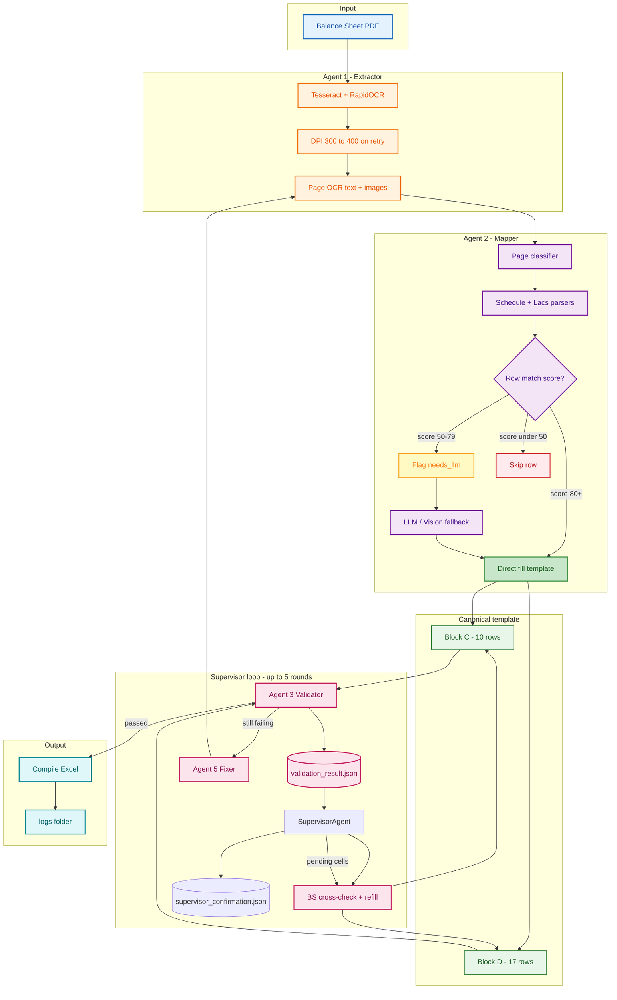
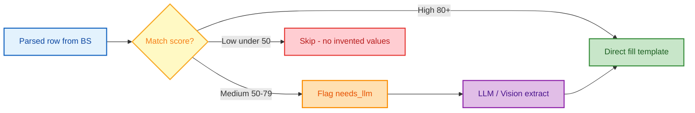

# Compile Sheet Extraction (Enterprise)

Extract **Block C (Fixed Assets)** and **Block D (Working Capital)** from **balance sheet PDF only** into a fixed Excel template. No compile schedule is required in production.

**Compile-style mapping:** BS note components are combined using rules in `config/compile_mapping_rules.json` (derived from compile schedule PDFs — no hard-coded company amounts). Profiles: `lacs_corporate` (Amounts in Lacs) and `rupees_schedule` (Schedule 6–10 style).

---

## Enterprise targets

| Stage | Target | Implementation |
|-------|--------|----------------|
| OCR accuracy | 95–98% | Indian number parsing, tabular Schedule 5/10 parsers, BS face anchors (`reconcile.py`) |
| **Financial validation** | **100%** | `compile_extraction/financial_validation.py` — **0.5% tolerance**, derived rows exact (±₹1) |
| Subtotal / total verification | Mandatory | C row 8 = Σ(2–7), C row 10 = 1+8+9; D rows 4,7,11,15,16 formulas |
| Auto-reconciliation | Required | `apply_financial_reconciliation()` before every Excel export |

**Financial rules enforced (no golden file):**

- Block C: `gross = net + dep`, depreciation roll-forward, gross movement, sub-total row 8, total row 10  
- Block D: inventory sub-total (4), total inventory (7), total current assets (11), total liabilities (15), working capital (16)  
- Optional: net block sum vs BS face PPE (note 5) within 3%

Pipeline export is blocked when financial validation &lt; 100% (`FINANCIAL_VALIDATION=1`, default).

```powershell
# Strict financial gate only (re-score existing Excel)
python main.py outputs\Compile_DSL_118184.xlsx --quality-only
```

---

## Generic design — nayi balance sheet par 60% kyun nahi hona chahiye

**Production path mein koi company amount hard-coded nahi hai.**  
`dsl_118184.json` / `dsl_114045.json` sirf **optional QA** ke liye hain — extraction inhe use nahi karti.

| Layer | Generic? | Naya PDF par kya hota hai |
|-------|----------|---------------------------|
| OCR + Indian numbers | Haan | Har PDF se amounts parse |
| Schedule 5 / 10 parsers | Haan | Label + table structure (Lacs **ya** Schedule 6–10) |
| `extract_bs_components` | Haan | **Dono** parsers chalate hain, merge karte hain |
| `compile_mapping_rules.json` | Haan | Profile **coverage score** se auto-select (`lacs_corporate` / `rupees_schedule`) |
| Face reconcile (PPE, Sl 14) | Haan | BS face / Schedule 10 lines se anchor |
| **Financial validation 100%** | Haan | Compile arithmetic — golden se independent |

**Do alag scores mat mix karo:**

1. **Financial validation (100% target)** — kya Excel ki rows 4+5=7, 8=subtotal, gross=net+dep **sahi jodti hain**? Nayi company par bhi reconcile ke baad **100%** rehna chahiye.
2. **Golden accuracy (85–95% variable)** — kya compile reference table se match hai? Ye OCR + note definition par depend karta hai; nayi company par golden file hogi hi nahi.

**Nayi company add karne par (generic):**

1. Sirf BS PDF chalao — koi code change nahi.
2. Agar format bilkul naya ho (alag note numbers): `python tools/learn_mapping_rules.py` se naya profile `config/compile_mapping_rules.json` mein add karo — **amounts nahi, sirf formulas** (`add` / `subtract` component keys).
3. Financial validation hamesha pass honi chahiye; golden optional.

**Pehle 95% / nayi par 60% isliye hota tha jab:**

- Galat profile (Lacs vs Schedule) lock ho jata tha  
- Golden compare ko production samajh liya jata tha  
- Schedule 10 total line Sl 14 mein chala jata tha  

Ab: dual-parser merge + profile auto-select + mandatory financial gate.

---

## Compile mapping (BS → ASI Block D)

| File | Role |
|------|------|
| `compile_extraction/bs_components.py` | Extract labeled amounts from BS OCR (notes, face, schedules) |
| `compile_extraction/compile_mapper.py` | Apply JSON rules → Block D rows |
| `config/compile_mapping_rules.json` | Row formulas (`add` / `subtract` component keys) |
| `tools/learn_mapping_rules.py` | Re-discover rules from golden + BS OCR (dev) |
| `tools/test_compile_mapping.py` | Compare mapped output vs `config/golden/*.json` |

**Source of truth (production):** balance sheet PDF + schedule OCR → component keys → JSON rules.  
`config/golden/*.json` is **QA only** (optional); a filled compile schedule can disagree with BS face or use a different ASI grouping (e.g. Sl 10 other current assets). Do not tune rules to match one golden value.

**Example (rupees_schedule Sl 10):** `face.other_current_assets = face.loans_and_advances − face.trade_receivables` (subsidy is already inside the loans line — not added twice).

Regenerate rules after new compile+BS pairs:

```powershell
python tools/learn_mapping_rules.py
python tools/test_compile_mapping.py
```

---

## Graphical architecture

### End-to-end flow



### Row routing (mapper confidence)



### `validation_result.json` (balance sheet only — no compile golden)

| Field | Meaning |
|--------|---------|
| `status: true` | Filled value matches re-parse from **same balance sheet** OCR |
| `status: false` | Mismatch or missing — BS Verifier agent targets this field |
| `expected_from_bs` | Value found again on BS summary / notes pages |
| `got` | Value currently in Block C / D |
| `hint_pages` | Which PDF pages to re-read |
| `fixed: true` | Verifier patched the template after re-check |

Golden JSON (`config/golden/`) is **optional QA only** — not used in this loop.

### `supervisor_confirmation.json` (final sign-off)

Written when **SupervisorAgent** finishes (success or max rounds).

| Field | Meaning |
|--------|---------|
| `complete: true` | All BS-verifiable cells match OCR; template fill done for rows/cols found on PDF |
| `complete: false` | See `pending` — cells still empty or mismatch vs BS re-parse |
| `block_c_filled` / `block_c_total` | Numeric cells filled in Block C |
| `block_d_filled` / `block_d_total` | Numeric cells filled in Block D |
| `message` | Human-readable confirmation (printed at end of pipeline) |

The CLI shows **GREEN SIGNAL — SUPERVISOR CONFIRMED** only when `complete: true` and internal math checks pass.

**Note 4 (PPE) parser** reads the full fixed-assets table on the notes page (gross, depreciation, net — not net-only). Supervisor `complete` requires Block C fill ≥ `SUPERVISOR_MIN_C_FILL_PCT` (default 65%), Block D complete, zero pending vs BS OCR, and BS field cross-check pass.

---

## Requirements

- Python 3.10+
- Tesseract OCR (`C:\Program Files\Tesseract-OCR\tesseract.exe`)
- Ollama on `http://localhost:11435`
- Models: `gemma4:31b` (vision + text)

```powershell
ollama pull gemma4:31b
pip install -r requirements.txt
```

---

## Quick start (production — balance sheet only)

```powershell
cd C:\Users\T6\Desktop\extract\data_extraction
.\venv\Scripts\Activate.ps1

$env:OLLAMA_BASE_URL = "http://localhost:11435"
$env:OLLAMA_VISION_MODEL = "gemma4:31b"
$env:OLLAMA_TEXT_MODEL = "gemma4:31b"

# BS verifier loop ON by default (recommended)
$env:VERIFY_LOOP = "1"

python main.py "data\Your_Balance_Sheet.pdf" -o "outputs\Your_Output.xlsx" --save-ocr
```

Or:

```powershell
.\run.ps1 "data\Your_Balance_Sheet.pdf" "outputs\Your_Output.xlsx"
```

---

## Environment variables

| Variable | Default | Purpose |
|----------|---------|---------|
| `OLLAMA_BASE_URL` | `http://localhost:11435` | LLM / vision API |
| `OLLAMA_VISION_MODEL` | `gemma4:31b` | Block C vision fallback |
| `OLLAMA_TEXT_MODEL` | `gemma4:31b` | Text mapper fallback |
| `VERIFY_LOOP` | `1` | Enable **SupervisorAgent** (BS OCR cross-check + auto-refill loop) |
| `SUPERVISOR_MAX_ROUNDS` | `5` | Max rounds until all BS-verifiable cells match OCR |
| `SKIP_BLOCK_D_LLM` | `0` | Set `1` to skip slow Block D LLM fallback |
| `MAX_ATTEMPTS` | `3` | Closed-loop retries (repair → check → fix) |
| `CLOSED_LOOP_STRICT_PENDING` | `0` | Set `1` to require `pending cells = 0` before loop exit |
| `COMPILE_MAPPING` | `1` | Apply `compile_mapping_rules.json` each attempt |

### Closed loop (each attempt)

1. **Repair** — `apply_financial_reconciliation` + compile mapping  
2. **Check** — strict financial validation + Supervisor (BS pending list)  
3. **Exit** when financial checks pass **and** compile rows filled (C≥5/6, D≥11/12)  
4. **Fix** — pending BS patches + Fixer re-map for failed rows  
5. **Export** — final reconcile + face validation

### Amount units (Lacs / Crores / Rupees)

All amounts are stored in **rupees**. `compile_extraction/amount_units.py` detects the unit from page headers:

| Header text | Unit | Multiplier |
|-------------|------|------------|
| `Amounts in Lacs` / `in lakhs` | LAKHS | × 1,00,000 |
| `Amounts in Crores` | CRORES | × 1,00,00,000 |
| Schedule 5 (8-column grid) | RUPEES | × 1 (Indian grouping) |

Lacs tokens (e.g. `4,656.93`) must **not** use crore-style comma grouping — that was the main bug on DSL 114045.

### Phase 2 — Schedule 5 gross OCR (Block C)

When one asset column OCR is wrong but the schedule **sub-total** row is reliable, the parser imputes:

`Plant gross = subtotal − sum(other assets)` (largest drifting row wins).

Re-applied after face reconcile so net scaling does not overwrite gross.

---

## Project layout

```
data_extraction/
  compile_extraction/
    audit.py           # Structured logs
    bs_verifier.py     # SupervisorAgent + BS cross-check + confirmation JSON
    config.py
    schema.py          # Block C (10) / Block D (17) templates
    excel.py
    quality.py         # Internal formula rules
    pipeline.py
  main.py              # CLI
  schedule_parser.py   # Deterministic BS parsers
  run_agentic_pipeline.py
  logs/{pdf_stem}/
    extraction.log
    ocr.log
    verification.log
    mapping.log
    validation_result.json   # ← BS cross-check (true/false per field)
    audit_report.json
    ocr_pages/
  config/golden/       # Optional QA only
  data/
  outputs/
```

---

## Agents summary

| Agent | Role | Source of truth |
|-------|------|-----------------|
| **1 Extractor** | OCR all PDF pages | Balance sheet PDF |
| **2 Mapper** | Fill Block C & D from schedules / notes | Balance sheet PDF |
| **3 Validator** | Row formulas (4=1+2+3, etc.) | Compile **template rules** |
| **4 BS Verifier** | Read `validation_result.json`, fix `status: false` | **Same balance sheet** re-OCR |
| **5 Fixer** | Re-run mapper for remaining errors | Balance sheet PDF |
| **Reporter** | Confidence + Excel write | — |

---

## Logs and audit

After each run:

```text
logs/Balance_Sheet_of_Your_Company/
  validation_result.json   # field-level status true/false vs BS re-parse
  audit_report.json
  extraction.log
  ocr.log
  verification.log
```

Example `validation_result.json` entry:

```json
{
  "block": "D",
  "sl_no": 9,
  "field": "closing_rs",
  "status": false,
  "reason": "bs_reparse_mismatch",
  "got": 378401000,
  "expected_from_bs": 378401000,
  "match_score": 95,
  "hint_pages": [1, 6],
  "fixed": true
}
```

---

## Optional golden (dev / QA only)

```powershell
python verify.py outputs\Your_Output.xlsx --golden config\golden\dsl_118184.json
```

Not used when `VERIFY_LOOP=1` production path runs.

---

## Notes

- Extraction is **generic** — no company numbers hard-coded in the pipeline.
- **100% accuracy** is not guaranteed (OCR limits, BS line ≠ compile row definitions); BS Verifier maximises correctness from the **same PDF**.
- Row 7 Block D = rows 4+5+6 (no goods-in-transit). Derived rows computed in Python.
- Two format families: **schedule annex** (e.g. 118184) and **amounts in lacs** (e.g. 114045).
