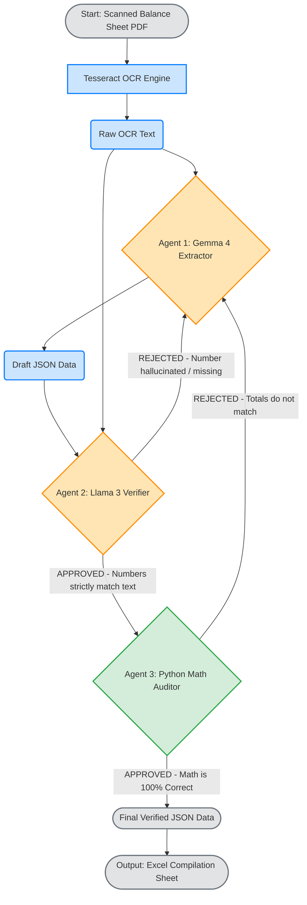

# data_extraction

Enterprise level generic data extraction pipeline using Open Source Tools (PyMuPDF, pdfplumber, Tesseract OCR, Ollama Vision LLM).

## Features

- Extracts raw text, tables, and images from scanned Financial PDFs.
- Automatic OCR for scanned images using Tesseract.
- **Agentic Workflow Architecture:** Highly secure, local, multi-agent validation loop for 100% accuracy.

## Multi-Agent Verification Workflow (Architecture)

This project utilizes a highly secure, completely offline Open-Source AI system to extract and validate sensitive government financial data.

### 🔑 Key Components:

- **Agent 1 (Extractor):** Gemma 4 running locally via Ollama.
- **Agent 2 (Verifier):** Llama 3 running locally via Ollama.
- **Agent 3 (Math Auditor):** The Deterministic Python Checker ensuring mathematical perfection.
- **Supervisor Loop Logic:** If any Verifier (Agent 2 or Agent 3) rejects the data, it triggers an automatic loop back to Agent 1 to try again.

.\venv\Scripts\python agentic_extraction_os.py
